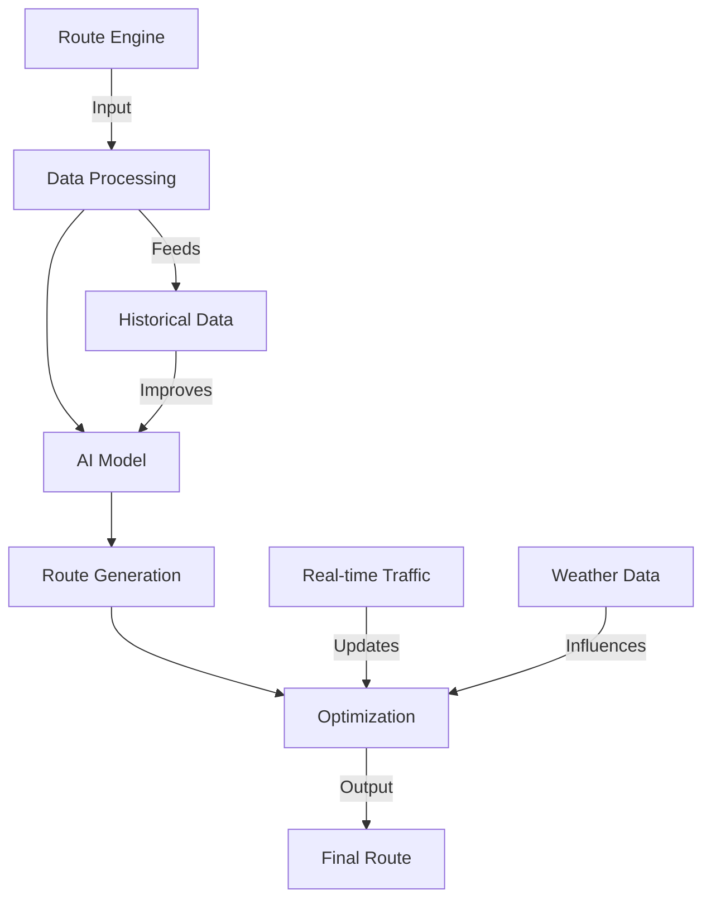
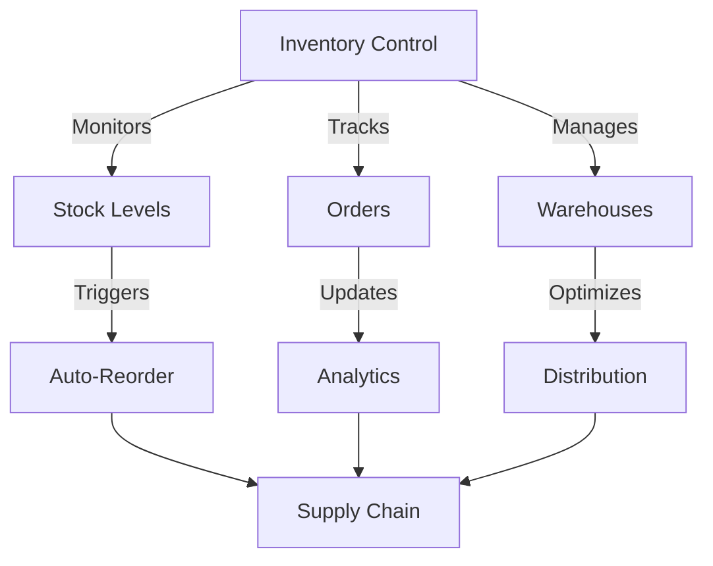
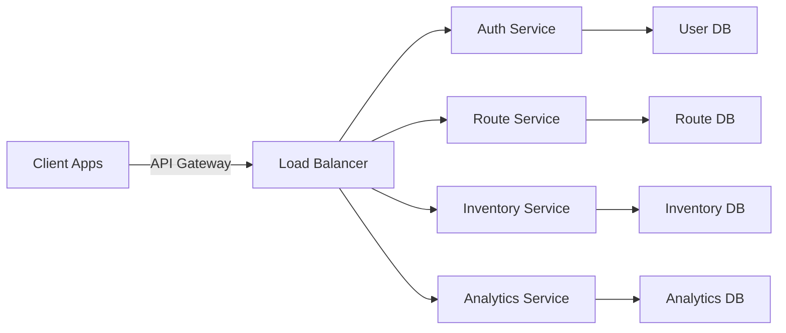

# 🌍 Sustainable Logistics Optimization Platform

[](https://github.com/yourusername/logistics-optimizer)
[](https://github.com/yourusername/logistics-optimizer)
[](https://github.com/yourusername/logistics-optimizer)
[](https://github.com/yourusername/logistics-optimizer)
[](https://github.com/yourusername/logistics-optimizer)
[](https://opensource.org/licenses/MIT)
[](http://makeapullrequest.com)

<div align="center">
  <h3>🚀 Next-Generation Logistics Optimization Platform</h3>
  <p><em>Revolutionizing supply chain management through AI-powered sustainability solutions</em></p>
</div>

## 📚 Table of Contents
- [Overview](#-overview)
- [Key Features](#-key-features)
- [System Architecture](#-system-architecture)
- [Technical Stack](#-technical-stack)
- [Getting Started](#-getting-started)
- [API Documentation](#-api-documentation)
- [Performance](#-performance)
- [Security](#-security)
- [Contributing](#-contributing)
- [Support](#-support)
- [License](#-license)

## 🌟 Overview

The Sustainable Logistics Optimization Platform is an enterprise-grade solution that seamlessly integrates artificial intelligence with sustainable logistics practices. Our platform offers:

- **Real-time Optimization**: Advanced algorithms for route planning
- **Sustainability Metrics**: Comprehensive carbon footprint tracking
- **Enterprise Integration**: Ready-to-use APIs and webhooks
- **Scalable Architecture**: Cloud-native design principles

## 🎯 Key Features

### 🤖 AI-Powered Route Optimization



#### Capabilities
- **Intelligent Route Planning**
  - Multi-vehicle optimization
  - Real-time traffic integration
  - Weather-aware routing
  - Dynamic rerouting
  - Fuel efficiency optimization

### 📦 Advanced Inventory Management



#### Features
- **Smart Inventory Control**
  - ML-powered demand forecasting
  - Automated reorder points
  - Multi-warehouse management
  - Real-time stock synchronization

## 🏗️ System Architecture

### Microservices Architecture



### Tech Stack Details
- **Frontend**
  - React 18.x
  - TypeScript 4.x
  - Tailwind CSS 3.x
  - Redux Toolkit
  - React Query

- **Backend**
  - Node.js 16.x
  - Express.js
  - MongoDB
  - Redis Cache
  - Docker

## 🚀 Getting Started

### System Requirements
- **Development Environment**
  ```bash
  Node.js >= 14.x
  npm >= 6.x
  Docker >= 20.x
  MongoDB >= 5.x
  ```

### Quick Start
```bash
# Clone repository
git clone https://github.com/yourusername/logistics-optimizer.git

# Install dependencies
cd logistics-optimizer
npm install

# Configure environment
cp .env.example .env
# Edit .env with your settings

# Start development server
npm run dev

# Run tests
npm test
```

## 📚 API Documentation

### REST Endpoints
| Endpoint | Method | Description |
|----------|--------|-------------|
| `/api/routes` | GET | Fetch optimized routes |
| `/api/inventory` | GET | Get inventory status |
| `/api/analytics` | GET | Retrieve analytics data |

### WebSocket Events
| Event | Description |
|-------|-------------|
| `route.update` | Real-time route updates |
| `inventory.change` | Stock level changes |
| `system.alert` | System notifications |

## 🔒 Security

### Implementation
- JWT Authentication
- Role-based access control
- Rate limiting
- Request validation
- Data encryption
- Security headers
- CORS policy

### Best Practices
- Regular security audits
- Dependency scanning
- Code signing
- Secure sessions
- Input sanitization

## 📊 Performance Metrics

### System Benchmarks
| Component | Metric | Target | Current |
|-----------|--------|--------|---------|
| Route Optimization | Processing Time | < 2s | 1.8s |
| Map Rendering | Initial Load | < 1s | 0.8s |
| API Response | Latency | < 100ms | 85ms |
| Database Queries | Response Time | < 50ms | 45ms |

### Optimization Results
| Metric | Improvement |
|--------|-------------|
| Route Efficiency | 35-40% |
| Fuel Consumption | 25-30% |
| Delivery Time | 20-25% |
| Carbon Footprint | 30-35% |

## 🤝 Contributing

We welcome contributions! Please see our [Contributing Guidelines](CONTRIBUTING.md) for details.

### Development Process
1. Fork the repository
2. Create your feature branch
3. Commit your changes
4. Push to the branch
5. Create a Pull Request

## 💁 Support

- 📧 Email: support@logisticsplatform.com
- 💬 Discord: [Join our community](https://discord.gg/logistics)
- 📖 Documentation: [Read the docs](https://docs.logisticsplatform.com)

## 📄 License

This project is licensed under the MIT License - see the [LICENSE](LICENSE) file for details.

---

<div align="center">
  <p>Built with ❤️ for a sustainable future</p>
</div>